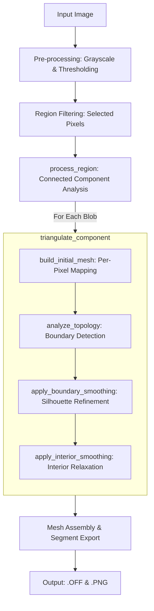

# BinaryImageMesher

A high-performance C++20 tool for generating high-quality 2D triangular meshes from binary images. This tool transforms image pixels into a structured mesh, separates independent components, and applies Laplacian smoothing to produce refined silhouettes suitable for simulations or 3D modeling.

## Features

- **Per-Pixel Triangulation**: Every foreground pixel is accurately represented by two triangles.
- **Independent Component Analysis**: Automatically detects and processes non-touching blobs as separate mesh entities.
- **Dual-Phase Smoothing**: 
  - **Boundary Smoothing**: Refines jagged pixel edges into smooth contours.
  - **Interior Smoothing**: Optimizes the internal mesh structure for triangle quality.
- **Cartesian Coordinate System**: Automatically flips image coordinates (Y-down) to standard Cartesian coordinates (Y-up) with CCW winding.
- **Standard Exports**: Saves results in `.off` (Object File Format) for 3D tools and `.png` for quick visualization.

## Technical Applications

This tool is designed for specialized engineering contexts where a high-density, structured mesh is required. Unlike contour-approximation algorithms (e.g., Marching Squares), this implementation maintains a 1-to-1 relationship with the pixel grid before relaxation.

### 1. Finite Element Analysis (FEA)
The preservation of the pixel-to-triangle mapping allows for direct mapping of image-based material properties (density, porosity, or thermal conductivity) to the simulation mesh. This is particularly useful in materials science for analyzing micrographs or medical imaging.

### 2. High-Fidelity 2D Physics
In collision detection systems, the dual-phase smoothing provides a refined geometric boundary that significantly reduces the "staircase" artifacts of pixel-based data, enabling more stable physical interactions with complex silhouettes.

### 3. Deformable 2D Animation
The high-density internal mesh provides the necessary degrees of freedom for high-quality deformation (skinning). The structured nature of the mesh ensures consistent vertex density across the entire object surface.

### 4. Mesh Optimization Ground Truth
This implementation serves as a "maximal information" baseline. It provides the highest possible geometric resolution for a given image, which can then be used to validate the accuracy of lossy mesh simplification (decimation) algorithms.

## Novelty

The primary novelty of this codebase lies in its specific hybrid workflow for pixel-to-mesh transformation, which prioritizes structural integrity over topological simplification.

### 1. "Anti-Simplification" Strategy
Unlike industry-standard algorithms (e.g., Marching Squares) that focus on reducing triangle count, this implementation treats every pixel as a high-fidelity data point. It uses geometric relaxation (smoothing) rather than topological reduction (decimation) to resolve pixelation, preserving a 1-to-1 data mapping often required for high-precision simulations.

### 2. Isolated Topological Smoothing
By integrating Connected Component Analysis (CCA) directly into the meshing pipeline, the tool constructs independent coordinate systems and adjacency maps for every discrete object. This allows for high-precision boundary smoothing that is mathematically isolated from neighboring objects, preventing the "blending" artifacts common in global smoothing algorithms.

### 3. Dual-Phase Sequential Relaxation
The implementation employs a strict Boundary-First relaxation sequence. By stabilizing the silhouette of the object before relaxing the interior, it significantly reduces the volume-loss (shrinking) effect that typically occurs with standard Laplacian smoothing applications.

### 4. Deterministic Grid Topology
Rather than using computationally expensive Delaunay Triangulation ($O(n \log n)$), this tool utilizes a Deterministic Grid Topology. By deriving connectivity directly from pixel coordinates, it achieves $O(n)$ (linear time) performance and produces a perfectly regular mesh free from the "skinny triangle" artifacts often generated by Delaunay-based approaches on binary data.

## Algorithm Pipeline



1. **Preprocessing**: Grayscale conversion and thresholding.
2. **Component Discovery**: Connected Component Analysis (CCA) to identify isolated islands of pixels.
3. **Local Renumbering**: Global-to-Local node mapping starting from 0 for each component.
4. **Meshing**: Direct triangulation of each pixel.
5. **Topology Analysis**: Identification of boundary edges (edges with exactly one triangle neighbor).
6. **Relaxation**: Iterative Laplacian smoothing with damping to prevent triangle inversion.

## Prerequisites

- **C++20** compatible compiler (e.g., GCC 10+, Clang 10+, MSVC 19.28+)
- **OpenCV 4.x** (core, imgproc, highgui, imgcodecs)
- **CMake 3.10+**

## Building

```bash
mkdir build
cd build
cmake ..
make
```

## Usage

```bash
./mesher <image_path> [options]
```

### Options

| Flag | Description | Default |
|------|-------------|---------|
| `-h, --help` | Show help message | - |
| `-t, --threshold` | Pixel intensity threshold (0-255) | 127 |
| `-r, --region` | Region to mesh (1: White, 0: Black) | 1 |
| `-si, --smooth-int`| Interior smoothing iterations | 10 |
| `-sb, --smooth-bnd`| Boundary smoothing iterations | 5 |
| `-o, --output` | Output OFF filename | output.off |

### Example

```bash
./mesher input.png -t 128 -si 20 -sb 10 -o my_mesh.off
```

## Testing

The project includes a modular test suite to verify triangulation logic, topology analysis, and component separation.

```bash
cd build
./run_tests
```

## License
MIT
